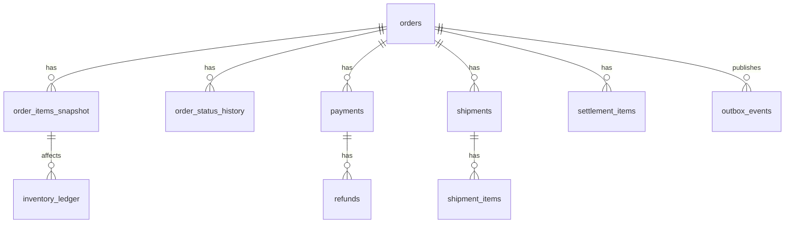

## 1. OMS 확장 ERD 개요

### 역할

- 쇼핑몰 주문 이후 OMS에서 필요한 데이터 구조(주문/결제/재고/배송/정산)를 안정적으로 분리하고 연결한다.

### 주요 책임

- 주문 스냅샷으로 과거 주문 이력 불변성 보장
- 주문 상태 이력으로 운영 추적성 확보
- 재고 ledger로 입출고/예약/조정 근거 보존
- 결제/환불/정산 테이블 분리로 금액 정합성 강화

### 주요 연관 도메인

- 주문(OMS), 결제(PG), 재고, 물류(배송), 정산

---

## 2. 아키텍처 · 설계

### 핵심 테이블 구성

- `orders`: 주문 헤더(주문자, 주문 기준 금액, 상태)
- `order_items_snapshot`: 주문 시점 상품/옵션/가격 스냅샷
- `order_status_history`: 주문 상태 변경 이력
- `payments`: 결제 승인/실패/멱등성 키
- `refunds`: 부분/전체 환불 이력
- `inventory_ledger`: 재고 원장(입고/예약/출고/조정)
- `shipments`, `shipment_items`: 부분배송 포함한 출고 단위
- `settlement_items`: 정산 기준 데이터
- `outbox_events`: 이벤트 발행 안정성 보장

### ERD 관계(요약)

### 컬럼/인덱스 기준(핵심)

- `orders`
  - PK: `id`(uuid), Unique: `order_id`
  - Index: `(orderer_user_id, created_at desc)`, `(status, created_at desc)`
- `order_items_snapshot`
  - FK: `order_id -> orders.id`
  - Index: `(order_id, line_seq)`, `(sku)`
- `order_status_history`
  - FK: `order_id -> orders.id`
  - Index: `(order_id, changed_at desc)`
- `payments`
  - FK: `order_id -> orders.id`
  - Unique: `idempotency_key`
  - Index: `(order_id, created_at desc)`, `(status)`
- `refunds`
  - FK: `payment_id -> payments.id`
  - Index: `(payment_id, created_at desc)`, `(status)`
- `inventory_ledger`
  - Index: `(sku, warehouse_id, created_at desc)`, `(reference_type, reference_id)`
- `shipments`
  - FK: `order_id -> orders.id`
  - Index: `(order_id)`, `(carrier, tracking_no)`
- `shipment_items`
  - FK: `shipment_id -> shipments.id`
  - Index: `(shipment_id, line_seq)`
- `settlement_items`
  - FK: `order_id -> orders.id`
  - Index: `(settlement_status, settlement_due_date)`, `(partner_id, created_at desc)`
- `outbox_events`
  - Unique: `(aggregate_type, aggregate_id, event_type, dedupe_key)`
  - Index: `(publish_status, next_retry_at)`

### 정합성 규칙

- 주문 금액(`orders.total_amount`)은 `order_items_snapshot.line_amount` 합계와 일치해야 한다.
- 환불 누적 금액은 결제 승인 금액을 초과할 수 없다.
- `inventory_ledger`에서 같은 `reference_type + reference_id + sku` 조합은 멱등 키로 중복 기록 방지한다.
- 배송 완료 상태는 최소 1건 이상 `shipment_items`가 존재해야 전이 가능하다.

### 트랜잭션 경계

- 주문 생성 트랜잭션: `orders` + `order_items_snapshot` + `order_status_history(CREATED)` + `outbox_events(OrderCreated)`
- 결제 승인 트랜잭션: `payments` 업데이트 + `order_status_history(PAYMENT_CONFIRMED)` + `outbox_events(PaymentConfirmed)`
- 출고 확정 트랜잭션: `shipments`/`shipment_items` + `inventory_ledger(OUTBOUND)` + `order_status_history(SHIPPED)`

---

## 3. API/이벤트 계약

### 주요 API 초안

- `POST /orders` : 주문 생성(스냅샷 저장)
- `GET /orders/:orderId` : 주문 상세(스냅샷/상태이력 포함)
- `POST /payments` : 결제 생성(멱등 키 필수)
- `POST /payments/confirm` : 결제 승인
- `POST /orders/:orderId/shipments` : 출고 생성
- `POST /payments/:paymentId/refunds` : 환불 생성(부분/전체)

### 주요 이벤트 초안

- `OrderCreated`
- `PaymentConfirmed`
- `OrderShipped`
- `RefundCreated`
- `SettlementReady`

---

## 4. 테스트 전략 (ERD 확장 기준)

### 단위 테스트

- 주문 금액 합계/환불 한도 검증
- 상태 전이 유효성(`CREATED -> PAYMENT_CONFIRMED -> SHIPPED`)

### 통합 테스트

- 주문 생성 시 스냅샷/상태이력/outbox 동시 생성 검증
- 결제 승인/환불 시 금액 정합성 및 이력 적재 검증
- 부분배송 시 주문 상태/배송 상태 일관성 검증

### 마이그레이션 검증

- 기존 `orders`, `payments` 데이터와 신규 FK/인덱스 호환 확인
- 롤백 스크립트에서 FK/인덱스 제거 순서 검증

---

## 5. 리스크 · TODO

### 리스크

- 기존 주문 데이터에 상품 스냅샷이 없어 신규 조회 모델로 마이그레이션 시 누락 가능성이 있다.
- 재고 ledger를 도입하면 쓰기량이 증가해 인덱스 과다 구성 시 insert 지연이 발생할 수 있다.
- 환불/정산 테이블 분리 시 기존 결제 조회 API와 응답 계약이 달라질 수 있다.

### 앞으로 개선하고 싶은 점

- 창고/로케이션 단위 재고 분리 모델 고도화
- 정산 배치 주기별 스냅샷 테이블(월/주 단위) 추가
- 주문/결제/정산 감사 로그(audit trail) 통합 조회 API 제공

---

## 6. 기능 추가 이력

### 2026-03-30 · OMS 확장 ERD 초안

- 배경: 쇼핑몰 + OMS 확장 시 주문/결제/재고/배송/정산 정합성을 코드 레벨에서 보장하기 위해 테이블 구조를 재정의했다.
- 변경점
  - 주문 스냅샷(`order_items_snapshot`)과 주문 상태 이력(`order_status_history`) 추가
  - 재고 원장(`inventory_ledger`), 배송(`shipments`/`shipment_items`) 구조 추가
  - 환불(`refunds`), 정산(`settlement_items`), 이벤트 발행(`outbox_events`) 테이블 추가
- 영향 범위
  - 마이그레이션, 주문/결제 서비스, 주문 상세 조회 API, 운영 조회 쿼리
- 롤백 포인트
  - 신규 테이블/인덱스 비활성 후 기존 `orders + payments` 중심 조회로 임시 복귀 가능

### 2026-03-30 · ERD 실구현 반영 (v1)

- 배경: 설계 문서 단계에서 끝내지 않고, 실제 백엔드 코드/DDL에 반영한 범위와 미구현 범위를 분리해 운영 혼선을 줄이기 위해 정리했다.
- 변경점
  - 실제 반영 테이블: `order_status_history`, `outbox_events`, `refunds`, `shipments`, `shipment_items`
  - 실제 반영 API 연결: 주문 상태 이력 조회, 출고 생성/확정, 환불 생성
  - 실제 반영 검증: 단위 테스트(OMS shipment, Payment refund) 추가
- 영향 범위
  - `docs/schema.sql`, `docs/erd.md`, OMS/Payment 모듈 엔티티·서비스·컨트롤러
- 롤백 포인트
  - 신규 API 라우트를 비활성화하고, 신규 테이블 사용 경로(환불/출고/outbox 운영)만 차단해 기존 주문/결제 핵심 흐름 유지 가능

### 구현 상태 체크리스트 (현재 기준)

- 완료
  - `order_status_history` 저장/조회 API
  - `outbox_events` 적재 + 운영 처리 상태(`PENDING|FAILED|DLQ|SUCCEEDED`)
  - `refunds` 생성(부분/전체 환불) + 금액 초과 검증
  - `shipments`/`shipment_items` 생성 + 출고 수량 초과 검증
- 미완료
  - `order_items_snapshot` 물리 테이블/코드 분리(현재는 `order_detail` 스냅샷 역할)
  - `inventory_ledger`, `settlement_items` 물리 구현
  - 환불/출고의 외부 시스템(실제 PG 취소/택배사) 연동

### 이력 템플릿 (복사해서 사용)

- 날짜:
- 기능명:
- 배경:
- 변경점:
- 영향 범위:
- 롤백 포인트:
