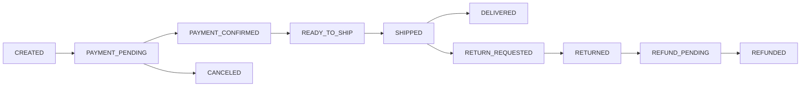

## 1. OMS 플로우 · API 개요

### 역할

- 주문 생성 이후 결제/재고/배송/클레임까지의 상태 전이와 API 계약을 운영 가능한 형태로 정리한다.

### 주요 책임

- 주문 상태 머신 정의 및 예외 전이 규칙 명문화
- API 요청/응답 계약과 에러 코드 표준화
- 부분취소/부분환불/부분배송 시 정합성 기준 고정

### 주요 연관 도메인

- 주문(OMS), 결제, 재고, 배송, 클레임(RMA), MQ 이벤트

---

## 2. 아키텍처 · 설계

### 주문 상태 전이

- 기본 상태: `CREATED -> PAYMENT_PENDING -> PAYMENT_CONFIRMED -> READY_TO_SHIP -> SHIPPED -> DELIVERED`
- 예외 상태: `CANCEL_REQUESTED`, `CANCELED`, `RETURN_REQUESTED`, `RETURNED`, `REFUND_PENDING`, `REFUNDED`
- 제한 규칙
  - `SHIPPED` 이후 전체 취소 불가(부분 반품/환불만 허용)
  - `PAYMENT_PENDING` 상태에서 결제 실패 시 `CANCELED` 전이 가능
  - `REFUNDED` 완료 전이는 결제/환불 합계 검증 통과 시에만 허용

### 상태 전이 시퀀스(요약)

### 데이터 정합성 규칙

- 부분배송: `shipment_items.quantity` 누적은 주문 라인 수량을 초과할 수 없다.
- 부분환불: `refunds.amount` 누적은 해당 결제 승인 금액을 초과할 수 없다.
- 취소/반품 시 재고 반영은 `inventory_ledger`에 `RESERVE_RELEASE` 또는 `INBOUND_RETURN` 이벤트로 남긴다.
- 주문 상태는 항상 `order_status_history`를 기준으로 복원 가능해야 한다.

---

## 3. API/이벤트 계약

### 주요 API 목록

- `POST /orders` : 주문 생성 + 상태 `CREATED`
- `POST /orders/:orderId/payments/prepare` : 결제 준비 + 상태 `PAYMENT_PENDING`
- `POST /orders/:orderId/payments/confirm` : 결제 승인 + 상태 `PAYMENT_CONFIRMED`
- `POST /orders/:orderId/shipments` : 출고 생성 + 상태 `READY_TO_SHIP`
- `POST /orders/:orderId/shipments/:shipmentId/dispatch` : 출고 확정 + 상태 `SHIPPED`
- `POST /orders/:orderId/cancel` : 주문 취소 요청/확정
- `POST /orders/:orderId/returns` : 반품 요청 생성
- `POST /payments/:paymentId/refunds` : 환불 요청 생성

### 에러 코드 정책(초안)

- `OMS_INVALID_STATUS_TRANSITION`: 허용되지 않은 상태 전이
- `OMS_PAYMENT_REQUIRED`: 출고 전에 결제 확정 미완료
- `OMS_SHIPMENT_QUANTITY_EXCEEDED`: 출고 수량 초과
- `OMS_REFUND_AMOUNT_EXCEEDED`: 환불 가능 금액 초과
- `OMS_ALREADY_CANCELED`: 이미 취소된 주문 재처리 요청
- `OMS_IDEMPOTENCY_CONFLICT`: 멱등 키 충돌

### 이벤트 계약(핵심)

- `OrderCreated(orderId, orderGroupId, totalAmount)`
- `PaymentConfirmed(orderId, paymentId, amount)`
- `ShipmentDispatched(orderId, shipmentId, trackingNo)`
- `OrderCanceled(orderId, reasonCode)`
- `RefundCompleted(orderId, paymentId, refundAmount)`

### 실패/보상 시나리오

- 결제 승인 성공 후 출고 생성 실패
  - 상태 유지: `PAYMENT_CONFIRMED`
  - 보상: 출고 재시도 큐 적재 + 알람
- 출고 완료 후 반품 승인
  - 상태 전이: `SHIPPED -> RETURN_REQUESTED -> RETURNED`
  - 보상: 재고 복원 ledger 반영 + 환불 프로세스 시작
- 환불 API 타임아웃
  - 상태 유지: `REFUND_PENDING`
  - 보상: 재시도 정책 + 수동 재처리 운영 API 제공

---

## 4. 테스트 전략 (플로우/API 기준)

### 단위 테스트

- 상태 전이 가드(허용/비허용 케이스)
- 주문 라인 단위 부분배송/부분환불 계산
- 에러 코드 매핑 및 예외 변환

### 통합 테스트

- 주문 생성 -> 결제 승인 -> 출고 확정 -> 배송 완료 happy path
- 결제 실패/재시도/중복요청 멱등 처리
- 부분취소/부분환불/부분배송 복합 시나리오

### E2E 테스트

- 인증 포함 주문~배송 플로우
- 관리자/고객사 권한별 조회 범위 검증
- 클레임 생성 후 환불 완료까지 추적 검증

---

## 5. 리스크 · TODO

### 리스크

- 상태 값이 서비스별로 중복 관리되면 전이 규칙 불일치로 장애가 발생할 수 있다.
- 외부 PG/택배사 연동 장애 시 `PENDING` 상태 누적으로 운영 처리량이 급격히 증가할 수 있다.
- 반품/환불 정책(배송비 차감, 부분환불 기준)이 문서화되지 않으면 CS 분쟁으로 이어질 수 있다.

### 앞으로 개선하고 싶은 점

- 주문 상태 머신을 코드 enum + DB check constraint로 이중 보강
- 클레임 정책(반품 사유 코드, 책임 주체) 도메인 규칙 명세화
- 운영자용 주문 상태 강제 전이 API(감사로그 포함) 추가

---

## 6. 기능 추가 이력

### 2026-03-30 · OMS 상태/계약 초안

- 배경: 쇼핑몰 주문 이후 OMS 운영에서 가장 자주 발생하는 실패 케이스(결제 지연, 부분배송, 부분환불)를 표준 상태 전이로 통합하기 위해 작성했다.
- 변경점
  - 주문 상태 머신과 예외 전이 규칙 정의
  - 주문/결제/배송/환불 API 계약 및 에러 코드 초안 정리
  - 실패/보상 시나리오 및 테스트 범위 명시
- 영향 범위
  - OMS 서비스 레이어, 컨트롤러, 에러 핸들링, E2E 테스트
- 롤백 포인트
  - 신규 상태를 feature flag로 제한하고 기존 핵심 플로우(`CREATED -> PAID -> SHIPPED`)만 유지 가능

### 2026-03-30 · OMS 플로우/API 실구현 반영 (v1)

- 배경: 계약 초안만으로는 프론트/운영에서 실제 사용 가능한 범위가 모호해, 구현 완료된 API 중심으로 상태를 명확히 했다.
- 변경점
  - 실구현 API 추가:
    - `GET /orders/:orderId/status-history`
    - `POST /orders/:orderId/shipments`
    - `POST /orders/:orderId/shipments/:shipmentId/dispatch`
    - `POST /payments/:paymentId/refunds`
  - 실구현 에러 코드 추가:
    - `OMS_SHIPMENT_INVALID_SKU`
    - `OMS_SHIPMENT_QUANTITY_EXCEEDED`
    - `OMS_SHIPMENT_NOT_FOUND`
    - `PAYMENT_NOT_FOUND`
    - `PAYMENT_NOT_REFUNDABLE`
    - `OMS_REFUND_AMOUNT_EXCEEDED`
- 영향 범위
  - OMS/Payment 컨트롤러 라우트, 서비스 검증 로직, 프론트 주문 상세/운영 콘솔 화면
- 롤백 포인트
  - 신규 라우트만 비활성화해도 기존 주문 생성/조회/결제 플로우는 유지 가능

### 프론트 연동 우선순위 (현재 구현 기준)

- 1순위
  - 주문 상세의 `상태 이력 탭` 연결
  - 운영 콘솔의 `출고 생성/출고 확정` 연결
  - 결제 상세의 `부분환불` 액션 연결
- 2순위
  - 상태 전이 타임라인 시각화(변경 주체/사유 포함)
  - 출고 수량 초과/환불 금액 초과 에러 UX 세분화
- 3순위
  - 반품/취소/환불 후속 상태 자동 전이 화면(현재는 일부 수동 조합 필요)

### 이력 템플릿 (복사해서 사용)

- 날짜:
- 기능명:
- 배경:
- 변경점:
- 영향 범위:
- 롤백 포인트:
