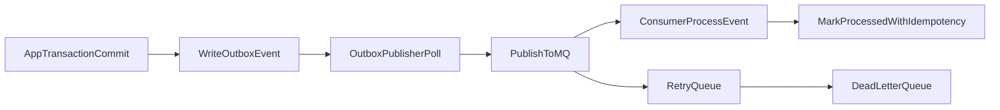

## 1. MQ · Outbox 개요

### 역할

- 주문/결제/배송/정산 후속 처리를 비동기로 분리해 성능과 장애 복원력을 높인다.

### 주요 책임

- DB 트랜잭션과 이벤트 발행 간 정합성 보장(Outbox)
- 소비자 멱등 처리로 중복 메시지 안전성 확보
- 재시도/DLQ/모니터링 체계로 운영 안정성 강화

### 주요 연관 도메인

- OMS, 결제, 재고, 정산, 알림, 운영 모니터링

---

## 2. 아키텍처 · 설계

### Outbox 패턴 핵심 흐름

- 서비스 트랜잭션에서 도메인 데이터 변경과 `outbox_events` insert를 동시에 커밋한다.
- Publisher 워커가 `outbox_events`를 polling하여 MQ에 발행한다.
- 발행 성공 시 `publish_status=SUCCEEDED`, 실패 시 `FAILED` + `retry_count` 증가

### 메시지 처리 흐름

### 이벤트 토픽(초안)

- `oms.order.created`
- `oms.payment.confirmed`
- `oms.shipment.dispatched`
- `oms.refund.completed`
- `oms.settlement.ready`

### 멱등성 설계

- Producer: `outbox_events.dedupe_key` 유니크 제약으로 중복 생성 차단
- Consumer: `consumer_offsets` 또는 `processed_events` 테이블에 `event_id + consumer_name` 유니크 저장
- 재처리 시 이미 처리된 이벤트는 skip하고 ACK 처리

### 재시도/DLQ 정책

- 즉시 재시도: 네트워크/일시 장애는 3회까지 exponential backoff
- 지연 재시도: 3회 실패 후 `next_retry_at` 기반 스케줄 재시도
- 최종 실패: DLQ 이동 + 운영 알람 발송
- DLQ 이벤트는 운영자가 원인 확인 후 수동 재발행 API로 처리

---

## 3. API/이벤트 계약

### 내부 운영 API 초안

- `POST /internal/outbox/replay/:eventId` : 실패 이벤트 재발행
- `GET /internal/outbox?status=FAILED` : 실패 이벤트 조회
- `GET /internal/mq/dlq` : DLQ 적재 목록 조회
- `POST /internal/mq/dlq/:id/requeue` : DLQ 이벤트 재큐잉

### 이벤트 페이로드 기본 규격

- 공통 필드
  - `eventId`(uuid)
  - `eventType`
  - `aggregateType`, `aggregateId`
  - `occurredAt`(ISO8601)
  - `traceId`, `orderId`, `userId`(가능 시)
  - `payload`(도메인 데이터)

### 버전 관리

- 이벤트 스키마는 `eventType` + `eventVersion`으로 관리
- 하위 호환 불가 변경은 신규 `eventVersion`으로 분리 발행

---

## 4. 테스트 전략 (MQ/Outbox 기준)

### 단위 테스트

- outbox 생성/발행 상태 전이(`PENDING -> SUCCEEDED|FAILED`)
- 멱등성 체크(중복 이벤트 skip)
- 재시도 백오프 계산 로직

### 통합 테스트

- 주문 생성 트랜잭션 커밋 후 outbox 이벤트 생성 검증
- publisher 장애 후 재기동 시 미발행 이벤트 재처리 검증
- consumer 중복 수신 시 1회만 비즈니스 반영 검증

### 운영 리허설

- MQ 다운/지연 상황에서 DLQ 적재 및 알람 동작 점검
- DLQ 수동 재큐잉 후 end-to-end 복구 검증

---

## 5. 리스크 · TODO

### 리스크

- outbox polling 주기가 길면 이벤트 지연이 누적되어 사용자 체감 지연이 커질 수 있다.
- 토픽/컨슈머 파티션 설계를 초기에 잘못 잡으면 순서 보장과 확장성 사이에서 재설계 비용이 커진다.
- 멱등 저장소 정리 정책이 없으면 장기적으로 테이블이 비대해진다.

### 앞으로 개선하고 싶은 점

- Debezium/CDC 기반 outbox relay 검토
- 큐 소비 지연 SLA 및 경보 임계치 자동 조정
- 이벤트 스키마 레지스트리 도입으로 계약 변경 통제

---

## 6. 기능 추가 이력

### 2026-03-30 · MQ/Outbox 운영 설계 초안

- 배경: 주문 이후 후속 작업(알림/정산/외부연동)을 동기 처리로 두면 지연과 장애 전파가 커져 비동기 파이프라인이 필요했다.
- 변경점
  - outbox 패턴 기반 이벤트 발행 구조 정의
  - producer/consumer 멱등성 규칙 및 중복 처리 전략 정의
  - 재시도, DLQ, 운영 API, 모니터링 포인트 정리
- 영향 범위
  - OMS/결제 서비스 트랜잭션, 배치/워커, 운영 도구, 알람 정책
- 롤백 포인트
  - 메시지 소비 비활성화 후 핵심 동기 플로우만 유지하고 outbox 적재만 보존하는 안전 모드 전환 가능

### 2026-03-30 · Outbox 운영 API 실구현 반영 (v1)

- 배경: 설계 문서만으로는 운영 콘솔 테스트가 어려워, outbox 수동 운영 API와 상태 전이 로직을 우선 구현했다.
- 변경점
  - 실구현 운영 API:
    - `POST /internal/outbox/process`
    - `POST /internal/outbox/retry-failed`
    - `GET /internal/outbox`
    - `POST /internal/outbox/replay/:eventId`
    - `GET /internal/mq/dlq`
    - `POST /internal/mq/dlq/:eventId/requeue`
  - 실구현 상태 전이:
    - `PENDING -> SUCCEEDED`
    - `PENDING -> FAILED`
    - 재시도 한도 초과 시 `FAILED -> DLQ`
    - 운영자 재큐잉 시 `FAILED|DLQ -> PENDING`
- 영향 범위
  - 운영 콘솔(Outbox/DLQ), 배치/워커 대체 수동 처리 흐름, 장애 대응 절차
- 롤백 포인트
  - `internal/*` 라우트 비활성화 후 자동 처리 경로만 유지하거나, outbox를 기록 전용으로 전환 가능

### 운영 가이드 (현재 구현 기준)

- 정상 점검
  - 주문 생성 후 `outbox_events`에 `PENDING` 적재 확인
  - `Outbox Process 실행` 후 `SUCCEEDED` 전이 확인
- 장애 점검
  - 실패 이벤트 조회(`GET /internal/outbox`) -> 재시도(`POST /internal/outbox/retry-failed`)
  - DLQ 조회(`GET /internal/mq/dlq`) -> 단건 재큐잉(`POST /internal/mq/dlq/:eventId/requeue`)
- 주의 사항
  - 현재 `process`는 기본 워커/크론이 아니라 수동 호출 중심
  - 실제 MQ 브로커 발행(kafka/rabbit/sqs)은 다음 단계에서 어댑터 교체 예정

### 이력 템플릿 (복사해서 사용)

- 날짜:
- 기능명:
- 배경:
- 변경점:
- 영향 범위:
- 롤백 포인트:
